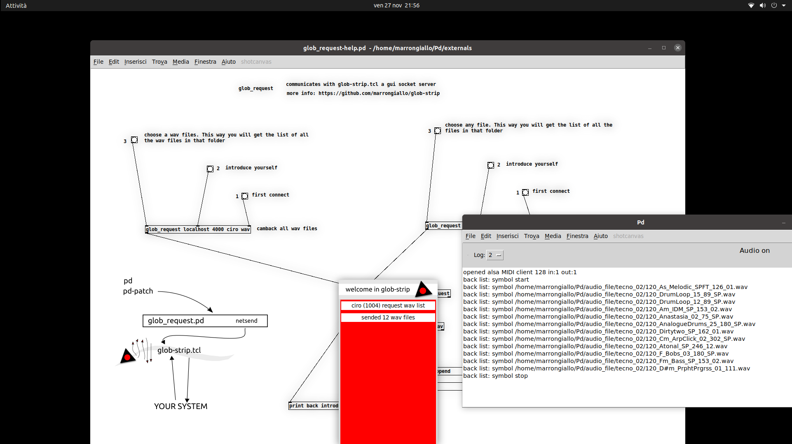

glob-strip
----------

glob-strip is a standalone script designed to supply information to a pure data abstraction (information about files in the system, which can be used for managing playlists for example).

The program has a GUI, the program window is always on top (-topmost).

Dependency
----------

Tcl Tk (is most likely already installed on your computer)

Install
-------

The script don't need installation, run: wish glob-strip.tcl

Usage
---

the script has no instructions, it responds to client requests by providing lists of files. The client instructions (the pure data abstraction glob_request.pd) can be found in the pd file glob_request-help.pd.

NB
----

The window does not have a topbar. To close the program: click on the window and press the esc key.

The script is open source and is written in the tcl programming language with TK).

In "pure data" you can use the "glob_request-hel.pd" patch which allows you to test communication with this server.

To do this you need to copy the "glob_request.pd" (the abstraction) and "glob_request-help.pd" files to the folder where PD looks for the "external". On my computer for example this folder is located in "~/Pd/externals".

When you are in pd you should open the "help" file which embed the abstraction. The abstraction won't work if you open it directly because of the arguments it needs. 

In this repository you can find the two pd files in the "pure_data_abstraction" folder.

Have fun

Lazzaro

a screenshot:

